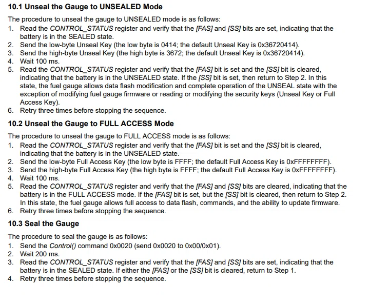
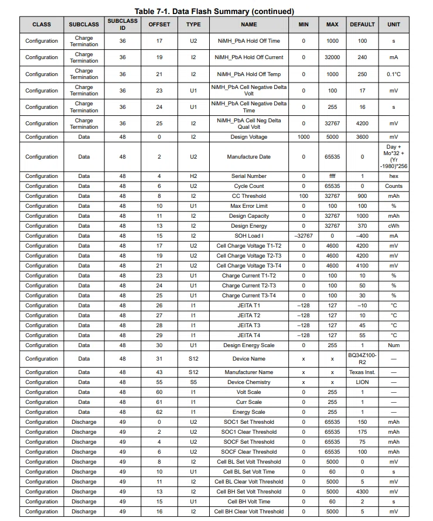
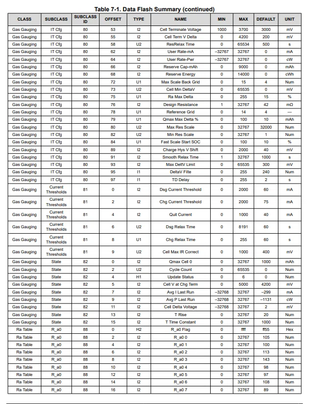
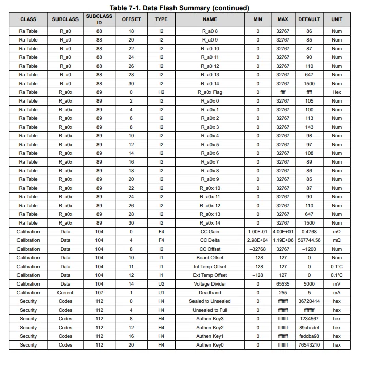
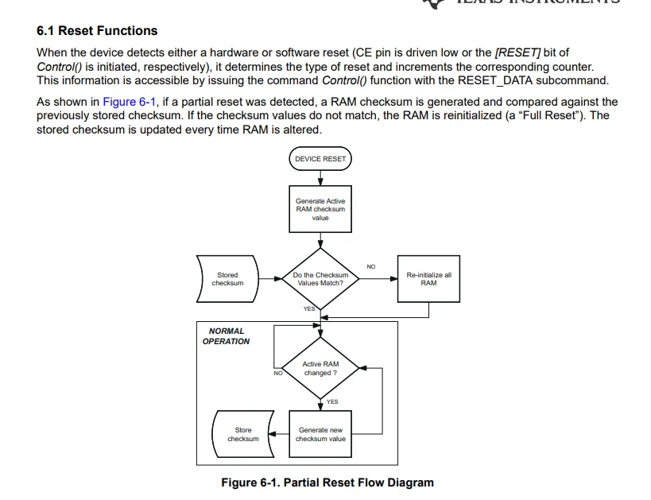

---

## **MANUAL STEPS - BQ34Z100-R2 Configuration (2S2P, 10Ah)**

---

### **STEP 1: Detect Gauge**

```bash
i2cdetect -y 2
# 0x55 ---> possible -o
```

---

### **STEP 2: Check Current Status**

```bash
# CTRL_STATUS - Check SS bit
i2cget -y 2 0x55 0x00 w
# Output: 0x6015 means SEALED

# Check Voltage
i2cget -y 2 0x55 0x08 w
# Output: 0x1EF4 = 7924 mV (Verify with dmm)

# Check Current
i2cget -y 2 0x55 0x10 w
# Output: 0x0000 = 0 mA ------> only if is not connnected 

# Flags check
i2cget -y 2 0x55 0x0E w
# Output: 0x0111 (CF=1, DSG=1, CHG=1)

# Check EnergyScale
i2cget -y 2 0x55 0x22
# Output: 0x49 = 73 (wrong ---> as per my current config)

# Check Design Capacity
i2cget -y 2 0x55 0x3C w
# Output: 0x881E = 34830 (Wrong ----> as per my current config)
```

---

### **STEP 3: Unseal the Gauge**

```bash
# Send Unseal Key Low (0x0414)
i2ctransfer -y 2 w3@0x55 0x00 0x14 0x04
sleep 0.2

# Send Unseal Key High (0x3672)
i2ctransfer -y 2 w3@0x55 0x00 0x72 0x36
sleep 0.3

# Verify unseal
i2cget -y 2 0x55 0x00 w
# Output: 0x4015 means UNSEALED (SS=0)
```


---

### **STEP 4: Enable IT (Impedance Track)**

```bash
# Enable IT
i2ctransfer -y 2 w3@0x55 0x00 0x21 0x00
sleep 0.1
```

---




### **STEP 5: Configure Subclass 0x30, Block 0**

```bash
# 5a: Select subclass 0x30, block 0
i2ctransfer -y 2 w2@0x55 0x3E 0x30
i2ctransfer -y 2 w2@0x55 0x3F 0x00
sleep 0.01

# 5b: Read current block (optional - for verification)
i2ctransfer -y 2 w1@0x55 0x40 r32 | xxd -p
# Output: current 32 bytes

# 5c: Write 32 bytes with new values
# Design Capacity = 10000 (0x2710)
# Design Energy = 3700 (0x0E74)
# Cell Charge T1-T2 = 4200 (0x1068)
# Cell Charge T2-T3 = 4200 (0x1068)
# Cell Charge T3-T4 = 4100 (0x1004)
# Design Energy Scale = 1 (0x01)
# Volt Scale = 1 (0x01)
# Curr Scale = 1 (0x01)

i2ctransfer -y 2 w33@0x55 0x40 \
0x00 0x00 0x00 0x00 0x00 0x00 0x00 0x00 \
0x00 0x00 0x27 0x10 0x0E 0x74 0x00 0x00 \
0x10 0x68 0x10 0x68 0x10 0x04 0x00 0x00 \
0x00 0x00 0x00 0x00 0x01 0x01 0x01 0x00

# 5d: Calculate checksum
# Read the block we just wrote
i2ctransfer -y 2 w1@0x55 0x40 r32 > /tmp/block0.bin

# Calculate sum
sum=$(xxd -p -c 32 /tmp/block0.bin | fold -w2 | while read byte; do
    echo $((0x$byte))
done | awk '{sum=sum+$1} END {print sum % 256}')

# Calculate checksum
checksum=$(( (0xFF - $sum) & 0xFF ))
echo "Block 0 checksum: 0x$(printf "%02X" $checksum)"

# 5e: Write checksum
i2ctransfer -y 2 w2@0x55 0x60 $checksum
sleep 0.01
```
---

### **STEP 6: Configure Subclass 0x30, Block 1**

```bash
# 6a: Select subclass 0x30, block 1
i2ctransfer -y 2 w2@0x55 0x3E 0x30
i2ctransfer -y 2 w2@0x55 0x3F 0x01
sleep 0.01

# 6b: Write 32 bytes for block 1
# Energy Scale = 1 (0x01) at offset 0
# Device Chemistry = "LION" at offset 23-26

i2ctransfer -y 2 w33@0x55 0x40 \
0x01 0x00 0x00 0x00 0x00 0x00 0x00 0x00 \
0x00 0x00 0x00 0x00 0x00 0x00 0x00 0x00 \
0x00 0x00 0x00 0x00 0x00 0x00 0x00 0x4C \
0x49 0x4F 0x4E 0x00 0x00 0x00 0x00 0x00

# 6c: Calculate checksum for block 1
i2ctransfer -y 2 w1@0x55 0x40 r32 > /tmp/block1.bin

sum=$(xxd -p -c 32 /tmp/block1.bin | fold -w2 | while read byte; do
    echo $((0x$byte))
done | awk '{sum=sum+$1} END {print sum % 256}')

checksum=$(( (0xFF - $sum) & 0xFF ))
echo "Block 1 checksum: 0x$(printf "%02X" $checksum)"

# 6d: Write checksum for block 1
i2ctransfer -y 2 w2@0x55 0x60 $checksum
sleep 0.01
```

---

### **STEP 7: Configure Subclass 0x52 (Gas Gauging|State)**

```bash
# 7a: Select subclass 0x52, block 0
i2ctransfer -y 2 w2@0x55 0x3E 0x52
i2ctransfer -y 2 w2@0x55 0x3F 0x00
sleep 0.01

# 7b: Write 32 bytes
# Qmax Cell 0 = 10000 (0x2710) at offset 0-1
# Update Status = 0x02 at offset 4
# Cell V at Chg Term = 4200 (0x1068) at offset 5-6

i2ctransfer -y 2 w33@0x55 0x40 \
0x27 0x10 0x00 0x00 0x02 0x10 0x68 0x00 \
0x00 0x00 0x00 0x00 0x00 0x00 0x00 0x00 \
0x00 0x00 0x00 0x00 0x00 0x00 0x00 0x00 \
0x00 0x00 0x00 0x00 0x00 0x00 0x00 0x00

# 7c: Calculate checksum
i2ctransfer -y 2 w1@0x55 0x40 r32 > /tmp/block52.bin

sum=$(xxd -p -c 32 /tmp/block52.bin | fold -w2 | while read byte; do
    echo $((0x$byte))
done | awk '{sum=sum+$1} END {print sum % 256}')

checksum=$(( (0xFF - $sum) & 0xFF ))
echo "Subclass 0x52 checksum: 0x$(printf "%02X" $checksum)"

# 7d: Write checksum
i2ctransfer -y 2 w2@0x55 0x60 $checksum
sleep 0.01
```



---

### **STEP 8: Configure Subclass 0x50 (Gas Gauging|IT Cfg)**

```bash
# 8a: Select subclass 0x50, block 1
i2ctransfer -y 2 w2@0x55 0x3E 0x50
i2ctransfer -y 2 w2@0x55 0x3F 0x01
sleep 0.01

# 8b: Write 32 bytes
# Cell Terminate Voltage = 3200 (0x0C80) at offset 21-22
# Cell Term V Delta = 200 (0x00C8) at offset 23-24

i2ctransfer -y 2 w33@0x55 0x40 \
0x00 0x00 0x00 0x00 0x00 0x00 0x00 0x00 \
0x00 0x00 0x00 0x00 0x00 0x00 0x00 0x00 \
0x00 0x00 0x00 0x00 0x00 0x0C 0x80 0x00 \
0xC8 0x00 0x00 0x00 0x00 0x00 0x00 0x00

# 8c: Calculate checksum
i2ctransfer -y 2 w1@0x55 0x40 r32 > /tmp/block50.bin

sum=$(xxd -p -c 32 /tmp/block50.bin | fold -w2 | while read byte; do
    echo $((0x$byte))
done | awk '{sum=sum+$1} END {print sum % 256}')

checksum=$(( (0xFF - $sum) & 0xFF ))
echo "Subclass 0x50 checksum: 0x$(printf "%02X" $checksum)"

# 8d: Write checksum
i2ctransfer -y 2 w2@0x55 0x60 $checksum
sleep 0.01
```

---

### **STEP 9: Configure Subclass 0x68 (CC Gain)**

```bash
# 9a: Select subclass 0x68, block 0
i2ctransfer -y 2 w2@0x55 0x3E 0x68
i2ctransfer -y 2 w2@0x55 0x3F 0x00
sleep 0.01

# 9b: Write 32 bytes with CC Gain
# CC Gain (Xemics format for ~0.4768 mΩ): 0x41200000 at offset 0-3
# CC Delta (Xemics format): 0x4B358C00 at offset 4-7

i2ctransfer -y 2 w33@0x55 0x40 \
0x41 0x20 0x00 0x00 0x4B 0x35 0x8C 0x00 \
0x00 0x00 0x00 0x00 0x00 0x00 0x00 0x00 \
0x00 0x00 0x00 0x00 0x00 0x00 0x00 0x00 \
0x00 0x00 0x00 0x00 0x00 0x00 0x00 0x00

# 9c: Calculate checksum
i2ctransfer -y 2 w1@0x55 0x40 r32 > /tmp/block68.bin

sum=$(xxd -p -c 32 /tmp/block68.bin | fold -w2 | while read byte; do
    echo $((0x$byte))
done | awk '{sum=sum+$1} END {print sum % 256}')

checksum=$(( (0xFF - $sum) & 0xFF ))
echo "CC Gain checksum: 0x$(printf "%02X" $checksum)"

# 9d: Write checksum
i2ctransfer -y 2 w2@0x55 0x60 $checksum
sleep 0.01
```


---

### **STEP 10: Reset Gauge**

```bash
# 10a: Send RESET
i2ctransfer -y 2 w3@0x55 0x00 0x41 0x00
sleep 0.3

# 10b: Unseal again (reset seals the gauge)
i2ctransfer -y 2 w3@0x55 0x00 0x14 0x04
sleep 0.2
i2ctransfer -y 2 w3@0x55 0x00 0x72 0x36
sleep 0.3

# 10c: Enable IT again
i2ctransfer -y 2 w3@0x55 0x00 0x21 0x00
sleep 0.1

# 10d: SOFT_RESET
i2ctransfer -y 2 w3@0x55 0x00 0x42 0x00
sleep 0.05
```


---

### **STEP 11: Verification**

```bash
echo "============================================================"
echo "=== VERIFICATION ==="
echo "============================================================"

# CTRL_STATUS - SS=0
ctrl=$(i2cget -y 2 0x55 0x00 w | cut -d' ' -f1)
ss=$(( (0x$ctrl >> 13) & 1 ))
echo "CTRL_STATUS: 0x$ctrl (SS=$ss) -> Should be SS=0"

# Voltage
volt=$(i2cget -y 2 0x55 0x08 w | cut -d' ' -f2)
volt_dec=$((0x$volt))
echo "Voltage: $volt_dec mV"

# Current
curr=$(i2cget -y 2 0x55 0x10 w | cut -d' ' -f2)
curr_dec=$((0x$curr))
if [ $curr_dec -gt 32767 ]; then
    curr_dec=$((curr_dec - 65536))
fi
echo "Current: $curr_dec mA"

# Flags
flags=$(i2cget -y 2 0x55 0x0E w | cut -d' ' -f2)
flags_dec=$((0x$flags))
cf=$(( (flags_dec >> 4) & 1 ))
dsg=$(( flags_dec & 1 ))
chg=$(( (flags_dec >> 8) & 1 ))
echo "Flags: 0x$flags (CF=$cf, DSG=$dsg, CHG=$chg)"

# Design Capacity - 10000 mAh
dcap=$(i2cget -y 2 0x55 0x3C w | cut -d' ' -f2)
dcap_dec=$((0x$dcap))
echo "Design Capacity: $dcap_dec mAh -> Should be 10000"

# EnergyScale - 1
es=$(i2cget -y 2 0x55 0x22)
echo "EnergyScale: $es -> Should be 1"

# CurrScale - 1 
cs=$(i2cget -y 2 0x55 0x21)
echo "CurrScale: $cs -> Should be 1"

# VoltScale - 1 
vs=$(i2cget -y 2 0x55 0x20)
echo "VoltScale: $vs -> Should be 1"

# CC Gain check
echo -n "CC Gain: "
i2ctransfer -y 2 w2@0x55 0x3E 0x68 2>/dev/null
i2ctransfer -y 2 w2@0x55 0x3F 0x00 2>/dev/null
i2ctransfer -y 2 w1@0x55 0x40 r4 2>/dev/null | xxd -p

echo ""
echo "============================================================"
echo "=== CONFIGURATION COMPLETE ==="
```

---

## **Quick Verification Commands:**

```bash
echo "=== ALL VALUES ==="
echo "EnergyScale: $(i2cget -y 2 0x55 0x22)"
echo "CurrScale: $(i2cget -y 2 0x55 0x21)"
echo "VoltScale: $(i2cget -y 2 0x55 0x20)"
echo "Design Cap: $(i2cget -y 2 0x55 0x3C w)"
echo "Voltage: $(i2cget -y 2 0x55 0x08 w)"
echo "Current: $(i2cget -y 2 0x55 0x10 w)"
echo "Flags: $(i2cget -y 2 0x55 0x0E w)"
```

---
